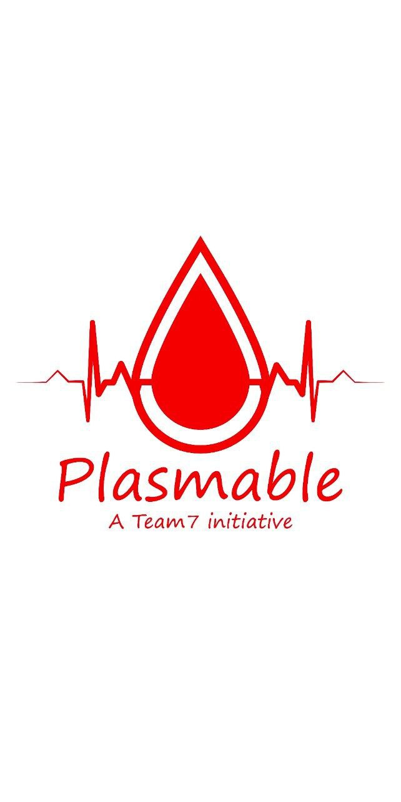
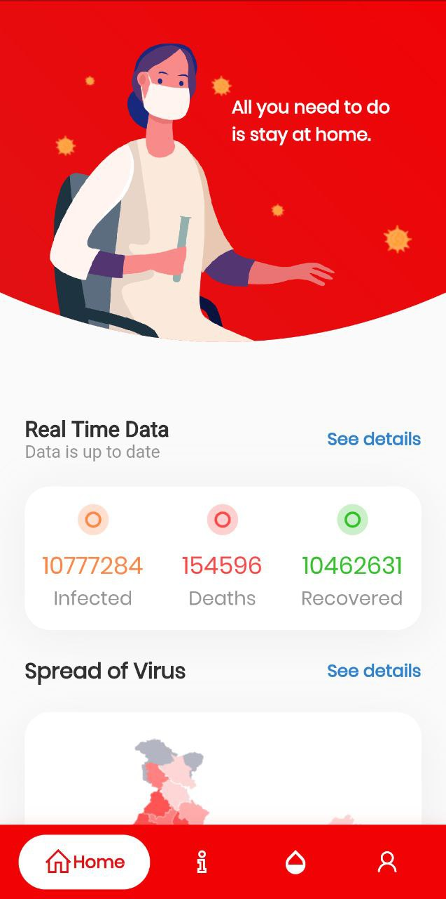
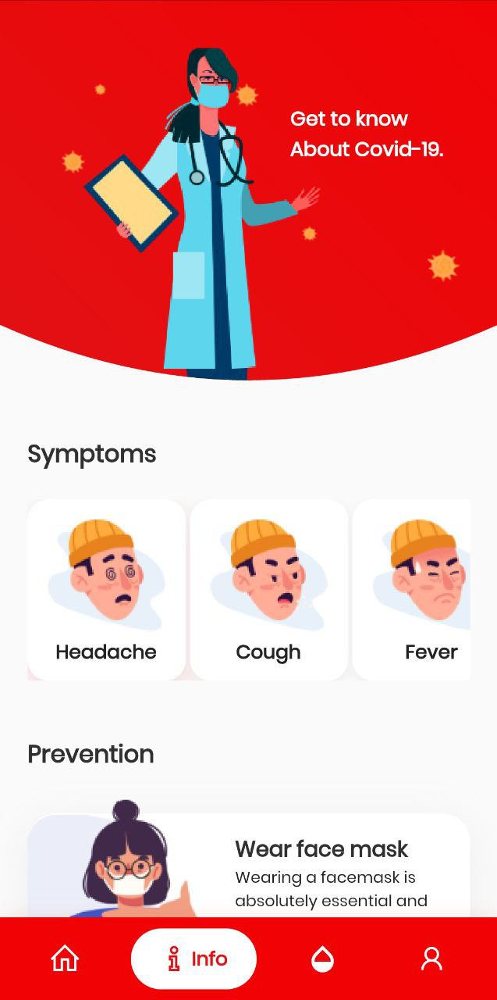
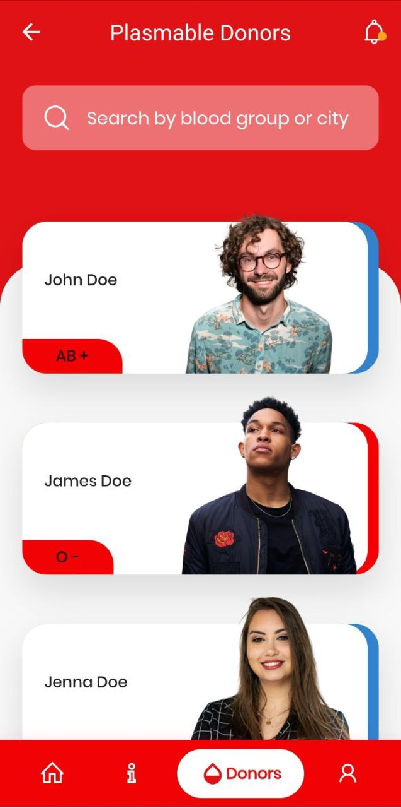

# Plasmable

## by Rijak Singh

**Packages we are using:**

- flutter_svg: [link](https://pub.dev/packages/flutter_svg)
- google_fonts: [link](https://pub.dev/packages/google_fonts)
- url_launcher: [link](https://pub.dev/packages/url_launcher)
- http: [link](https://pub.dev/packages/http)
- shared_preferences: [link](https://pub.dev/packages/shared_preferences)

**Fonts**

- Poppins [link](https://fonts.google.com/specimen/Poppins)

Plasmable is an app developed with one clear goal in our minds, helping people. Plasmable helps connect people in need with verified plasma donors. The users of our app will have no problem finding a suitable match for their plasma requirement. Plasmable also helps clear misconceptions about real covid-19 statistics by providing real-time, WHO verified information. With Plasmable you are truly safe.

Screenshots of the interface:

   
